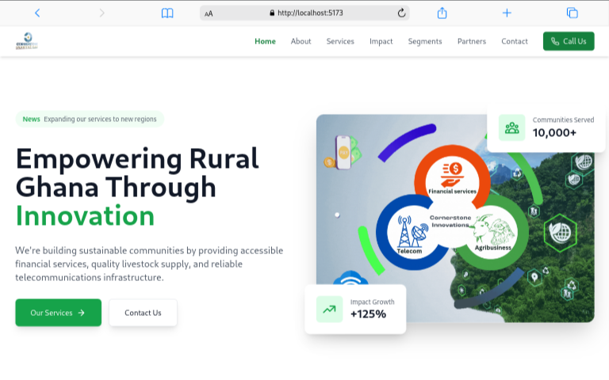

# Cornerstone Innovations

A modern web application built with React, TypeScript, and Tailwind CSS, designed to serve rural communities in Ghana through financial services, agriculture, and telecommunications.



## Features

### 🏦 Mobile Financial Services
- Secure mobile money transfers
- Bill payments and digital wallets
- Financial literacy programs
- Fraud mitigation services
- Bank-grade encryption
- Multi-device accessibility

### 🐔 Livestock Supply
- Quality poultry and goat supply
- Sustainable farming practices
- Technical support and training
- Market access facilitation
- Veterinary services
- Fair pricing system

### 📱 Telecommunications
- Affordable mobile devices
- Reliable network coverage
- Internet connectivity solutions
- 24/7 customer support
- Data packages
- Local language support

## Key Components

### 📱 Responsive Design
- Mobile-first approach
- Seamless experience across devices
- Optimized performance

### 🎨 Modern UI/UX
- Clean and intuitive interface
- Smooth animations
- Interactive components
- Consistent branding

### 🔒 Security
- Secure transactions
- Data encryption
- Privacy protection
- Regular security updates

## Technology Stack

### Frontend
- React 18
- TypeScript
- Tailwind CSS
- Framer Motion
- React Router DOM
- Lucide Icons

### Development Tools
- Vite
- ESLint
- PostCSS
- Autoprefixer

## Getting Started

### Prerequisites
- Node.js (v14 or higher)
- npm or yarn

### Installation

1. Clone the repository
```bash
git clone https://github.com/Redemption19/c-stone.git
```

2. Install dependencies
```bash
cd c-stone
npm install
```

3. Start development server
```bash
npm run dev
```

4. Build for production
```bash
npm run build
```

## Project Structure

```
src/
├── components/
│   ├── about/         # About page components
│   ├── blog/          # Blog components
│   ├── contact/       # Contact form and info
│   ├── home/          # Homepage components
│   ├── impact/        # Impact metrics and testimonials
│   ├── layout/        # Header and footer
│   ├── partners/      # Partner components
│   ├── segments/      # Customer segments
│   └── services/      # Service offerings
├── pages/             # Main page components
├── App.tsx           # Main application component
└── main.tsx         # Application entry point
```

## Features by Section

### 🏠 Homepage
- Hero section with key messaging
- Service overview cards
- Impact metrics
- Animated FAQ section

### 👥 About
- Company mission and vision
- Team profiles
- Company history
- Branch locations

### 🛠️ Services
- Detailed service descriptions
- Service benefits
- Interactive features
- Call-to-action buttons

### 📊 Impact
- Success metrics
- Community impact stories
- Visual data representation
- Testimonials

### 🤝 Partners
- Partner showcase
- Collaboration benefits
- Partnership testimonials
- Partnership opportunities

### 📱 Contact
- Interactive contact form
- Office locations
- Business hours
- Social media links

## Contributing

1. Fork the repository
2. Create your feature branch (`git checkout -b feature/AmazingFeature`)
3. Commit your changes (`git commit -m 'Add some AmazingFeature'`)
4. Push to the branch (`git push origin feature/AmazingFeature`)
5. Open a Pull Request

## License

This project is licensed under the MIT License - see the [LICENSE](LICENSE) file for details.

## Acknowledgments

- Design inspiration from modern fintech applications
- Icons provided by Lucide React
- Images from Unsplash
- Community feedback and support

## Support

For support, email info@cornerstone.com or join our Slack channel.

## Roadmap - Features to be implemented

- [ ] Add multi-language support
- [ ] Implement real-time chat support
- [ ] Add mobile app integration
- [ ] Expand service offerings
- [ ] Add user dashboard
- [ ] Implement payment gateway
- [ ] Add offline support

## Status


